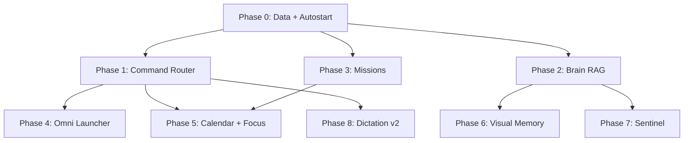

# DEXTER — Build Specification & Implementation Framework

> **Version:** 1.0  
> **Audience:** Claude Code, future contributors, you  
> **North star:** A local-first, single-user personal operations system that behaves like Iron Man's JARVIS — voice-first, context-aware, action-capable, and gamified around the Placement Pentagon.

---

## Table of Contents

1. [Vision & Scope](#1-vision--scope)
2. [Current Architecture](#2-current-architecture-as-built)
3. [Global Constraints](#3-global-constraints-non-negotiable)
4. [Data Model](#4-data-model-dexter-datajson)
5. [Command Router Architecture](#5-command-router-architecture-target-state)
6. [Sidecar Pattern](#6-sidecar-pattern-mandatory-for-python-modules)
7. [Implementation Phases](#7-implementation-phases-ordered)
8. [Dependency Graph](#8-dependency-graph)
9. [Per-Feature Spec Template](#9-per-feature-spec-template)
10. [Testing Checklist](#10-testing-checklist-manual)
11. [Target Folder Structure](#11-recommended-folder-structure-target)
12. [Claude Code Instructions](#12-claude-code-instructions)
13. [Priority Summary](#13-priority-summary)
14. [Command Registry (as-built)](#14-command-registry-as-built)
15. [Out of Scope](#15-out-of-scope-v1)
16. [Axis Trackers (detailed)](#16-axis-trackers-detailed)

---

## 1. Vision & Scope

### What Dexter is

A Windows desktop **Electron shell** + **Python sidecars** that unifies:

- Placement sprint tracking (5 axes)
- Life domains (training, reading, creative)
- Gamification (XP, quests, achievements)
- Voice assistant + global dictation (WisprFlow-style)
- External service bridges (Notion, LeetCode, news, optional LLM)

### What Dexter is NOT

- Not multi-user SaaS
- Not a cloud-first app
- Not a full clone of Jira, Rewind, or Raycast — only **minimal viable slices** of each
- Not dependent on always-on internet (core must work offline)

### Success criteria (JARVIS bar)

| Capability | Target |
|------------|--------|
| Voice command latency | < 2s for local intents |
| Dictation | Works in any focused app, offline |
| Data persistence | Same data on autostart, manual launch, and after reboot |
| Question answering | Grounded in user's notes + live stats when RAG is built |
| Task execution | Open apps, log sessions, create tasks, start timers via voice |
| Privacy | Audio and screen context stay local unless user opts in |

---

## 2. Current Architecture (as-built)

```
Dexter/
├── main.js              # Electron main: IPC, storage, integrations, sidecar spawn
├── preload.js           # contextBridge API → window.dexter
├── package.json
├── src/
│   ├── index.html       # HUD views (7 dock modules)
│   ├── app.js           # UI, game engine, voice router, commands (~1300 LOC)
│   └── styles.css
├── voice/
│   └── dexter_voice.py  # Wake-word STT sidecar (Vosk)
├── dictate/
│   ├── dexter_dictate.py
│   └── README.md        # WisprFlow-style push-to-talk
├── scripts/
│   └── seed.js          # Seeds historical data from Notion import
└── docs/
    ├── BUILD.md         # Master build spec (this file)
    └── TRACKERS.md      # Per-axis session trackers (DSA, Floodgate, Core CS, SD, Comm, Blogs)
```

### Runtime data paths (canonical — must be unified)

| Asset | Intended path |
|-------|----------------|
| App database | `%APPDATA%\dexter\dexter-data.json` |
| Vosk model | `%USERPROFILE%\.dexter\vosk-model\` |
| Dictate history | `%USERPROFILE%\.dexter\dictate-history.jsonl` |
| Dictate dictionary | `%USERPROFILE%\.dexter\dictate-dict.json` |
| Renderer log | `%APPDATA%\dexter\renderer.log` |
| Vector index (future) | `%USERPROFILE%\.dexter\brain\` |

### Known bug: data disappears on Windows autostart

**Root cause:** `main.js` uses `app.getPath('userData')` while `scripts/seed.js` hardcodes `%APPDATA%\dexter\`. When autostart launches raw `electron.exe`, Electron may use `%APPDATA%\Electron\` instead — a separate empty `dexter-data.json`.

**Fix:** Phase 0 unifies paths and migrates legacy files. See [Phase 0](#phase-0--foundation-blocker-do-before-anything-else).

### IPC surface (`preload.js` → `window.dexter`)

**Existing handlers:**

| Preload method | IPC channel | Purpose |
|----------------|-------------|---------|
| `readStore()` | `store:read` | Load dexter-data.json |
| `writeStore(data)` | `store:write` | Save dexter-data.json |
| `fetchLeetCode(username)` | `leetcode:fetch` | LeetCode GraphQL stats |
| `setAutostart(enabled)` | `autostart:set` | Windows login item |
| `notionPull(token, dbId)` | `notion:pull` | Query Notion database |
| `notionPush(token, dbId, props)` | `notion:push` | Create Notion page |
| `voiceStart()` / `voiceStop()` | `voice:start` / `voice:stop` | STT sidecar |
| `onVoice(cb)` | `voice:event` | STT events |
| `dictateStart()` / `dictateStop()` | `dictate:start` / `dictate:stop` | Dictation sidecar |
| `onDictate(cb)` | `dictate:event` | Dictation events |
| `fetchNews()` | `news:fetch` | Hacker News front page |
| `launchApp(query)` | `apps:launch` | Open app/URL/file |
| `askLlm(apiKey, system, text)` | `llm:ask` | Anthropic Claude Haiku |

**Rule for new features:** add handler in `main.js` → expose in `preload.js` → call from `app.js` command router.

---

## 3. Global Constraints (non-negotiable)

### 3.1 Platform

- **Primary:** Windows 10/11
- **Paths:** Avoid non-ASCII paths for Vosk/Kaldi (known issue — project may live at `d:\文档\...`; model must stay under `~/.dexter/`)
- **Mic sharing:** Voice + dictate both use shared-mode capture; design for coexistence

### 3.2 Local-first

- Default: no cloud required
- Cloud APIs (Notion, Linear, Calendar, Anthropic) are **optional modules** gated by settings tokens
- Sidecars communicate via **JSON lines on stdout** (existing pattern)

### 3.3 Code style (match existing codebase)

- Minimal dependencies; no React/Vue — vanilla JS in renderer
- No over-abstraction; inline helpers OK in `app.js` until a module exceeds ~200 LOC
- Python sidecars: single-file scripts, `pip install` documented in module README
- Comments only for non-obvious business logic
- Don't refactor unrelated code when implementing a feature

### 3.4 Security

- API keys stored in `dexter-data.json` settings (acceptable for single-user local app)
- Never log tokens to `renderer.log`
- Screen capture / OCR modules must have **explicit opt-in toggle** in SYS
- No telemetry

### 3.5 Single-instance

- `app.requestSingleInstanceLock()` already used — new sidecars must not spawn duplicates; check `already: true` pattern in `main.js`

### 3.6 Autostart

- Dev autostart via raw `electron.exe` is **fragile** — Phase 0 must fix
- Production autostart must use packaged `.exe` or `scripts/start-dexter.bat`

---

## 4. Data Model (`dexter-data.json`)

### Current schema (do not break without migration)

```jsonc
{
  "settings": {
    "leetcodeUsername": "",
    "autostart": true,
    "tts": true,
    "dictate": true,
    "notionToken": "",
    "notionDailyLogDb": "8021776f-fee7-403f-b8e7-5f2f45941e0c",
    "notionRatingsDb": "b4050e5e-3c6a-44a4-a9fd-6538361369c5",
    "notionWorkoutsDb": "6c82c364-8e01-4b91-9036-9d8178ae2bba",
    "anthropicKey": ""
  },
  "axes": ["DSA", "Core CS", "System Design", "Portfolio", "Communication"],
  "ratings": [],
  "dailyLogs": [],
  "workouts": [],
  "creative": [],
  "reading": [],
  "leetcode": null,
  "game": {
    "xp": 0,
    "level": 1,
    "achievements": [],
    "questLog": {}
  }
}
```

### Future schema extensions (additive only)

```jsonc
{
  "missions": [],
  "snippets": {},
  "clipboardRing": [],
  "focusBlocks": [],
  "screenIndex": [],
  "integrations": {
    "linear": { "apiKey": "", "teamId": "" },
    "calendar": { "icsUrl": "" },
    "github": { "token": "", "repos": [] },
    "brain": { "vaultPath": "", "lastIndexed": "" }
  }
}
```

### Migration rule

On `loadData()`, if new fields missing → merge from `DEFAULT_DATA`. If canonical file missing → check legacy paths (`%APPDATA%\Electron\`, old seed path) and **import, never overwrite**.

---

## 5. Command Router Architecture (target state)

All voice and text commands flow through one function: `handleCommand(raw)` in `src/app.js`.

### Intent layers (priority order)

```
1. Navigation      → switchView(...)
2. Logging         → log session/workout/reading
3. System queries  → stats, level, time, news
4. Launchers       → openTarget() — apps, URLs, files
5. Integrations    → notion push, leetcode sync, missions, calendar
6. Persona regex   → PERSONA[] — instant offline replies
7. RAG retrieval   → brain:ask (Phase 2)
8. LLM fallback    → askLlm() if anthropicKey set
```

### New command registration template

```js
// In app.js handleCommand(), BEFORE agentAsk():
if (/pattern/.test(t)) return doThing();
```

Document every new command in §14 of this file (or `docs/COMMANDS.md` when split out).

---

## 6. Sidecar Pattern (mandatory for Python modules)

Every Python sidecar must follow `voice/dexter_voice.py` / `dictate/dexter_dictate.py`:

```
module/
├── dexter_<name>.py    # main script
├── README.md           # hotkeys, deps, JSON protocol, limitations
└── requirements.txt    # optional, pinned versions
```

### JSON line protocol (stdout)

```json
{"type":"ready"}
{"type":"error","text":"..."}
{"type":"<event>"}
```

### Electron spawn template (main.js)

- `spawn('python', [script], { cwd: scriptDir })`
- Buffer stdout, split on `\n`, parse JSON, `win.webContents.send('<name>:event', msg)`
- `stop<Name>()` on `before-quit`
- IPC: `<name>:start`, `<name>:stop`

---

## 7. Implementation Phases (ordered)

### Phase 0 — Foundation (BLOCKER: do before anything else)

**Goal:** Stable data, reliable autostart, observability.

| ID | Task | Files | Acceptance |
|----|------|-------|------------|
| 0.1 | Canonical data path constant | `main.js`, `scripts/seed.js`, new `lib/paths.js` | Both read/write `%APPDATA%\dexter\dexter-data.json` |
| 0.2 | `app.setName('dexter')` before first `getPath` | `main.js` | `userData` always `...\dexter\` |
| 0.3 | Legacy migration on boot | `main.js` `loadData()` | If data in `Electron\` folder, merge into canonical |
| 0.4 | Startup path logging | `main.js` | First line in `renderer.log`: `DATA_FILE=<path>` |
| 0.5 | Safe load — don't write defaults over missing file | `main.js` | Failed read → empty in-memory only until user saves |
| 0.6 | Dev autostart fix | `scripts/start-dexter.bat`, `main.js` | Login launches bat → `npm start`, not raw electron.exe |
| 0.7 | Packaged build stub | `package.json`, electron-builder config | `npm run dist` produces `Dexter.exe` |

**Exit criteria:** Reboot → autostart → all ratings/logs/XP visible. Seed script and app use same file.

#### Phase 0 detailed spec

**`lib/paths.js`** (create):

```js
const path = require('path');
const os = require('os');

const DEXTER_DIR = path.join(process.env.APPDATA || path.join(os.homedir(), 'AppData', 'Roaming'), 'dexter');
const DATA_FILE = path.join(DEXTER_DIR, 'dexter-data.json');
const LEGACY_PATHS = [
  path.join(process.env.APPDATA || '', 'Electron', 'dexter-data.json'),
  path.join(DEXTER_DIR, 'dexter-data.json')
];

module.exports = { DEXTER_DIR, DATA_FILE, LEGACY_PATHS };
```

**Migration logic in `loadData()`:**

1. If `DATA_FILE` exists → load and merge with `DEFAULT_DATA`
2. Else scan `LEGACY_PATHS` for largest non-empty file → copy to `DATA_FILE`
3. Else return deep copy of `DEFAULT_DATA` (do not write until user saves)

**`scripts/start-dexter.bat`:**

```bat
@echo off
cd /d "%~dp0.."
npm start
```

Update `setLoginItemSettings` to point to this bat in dev mode.

---

### Phase 1 — Intent Router Hardening

**Goal:** Voice/text commands are reliable and extensible.

| ID | Task | Files | Acceptance |
|----|------|-------|------------|
| 1.1 | Extract `handleCommand` intents to `src/commands/` map | `src/commands/index.js` | Each intent = `{ test, run }` |
| 1.2 | Command registry doc | `docs/COMMANDS.md` | All commands listed with examples |
| 1.3 | Fuzzy open launcher | `main.js` `launchApp` | "open code" → VS Code; show candidates on miss |
| 1.4 | Snippet registry (local) | `app.js`, data schema | `snippets` object; voice "paste tmay" |
| 1.5 | Confirm destructive actions | `app.js` | "are you sure" for clear/reset (if any) |

---

### Phase 2 — The Brain (Obsidian/Notion RAG)

**Goal:** Answer questions from user's own notes. Biggest JARVIS leap.

**Inspired by:** Obsidian, Notion AI, ChatGPT Files

| ID | Task | Files | Acceptance |
|----|------|-------|------------|
| 2.1 | Vault indexer sidecar | `brain/dexter_brain.py` | Index folder or Notion export → chunks in SQLite |
| 2.2 | Local embeddings | `brain/` + Ollama `nomic-embed-text` OR `sentence-transformers` | Fully offline option |
| 2.3 | `brain:query` IPC | `main.js`, `preload.js` | Returns top-k chunks + scores |
| 2.4 | Voice: "ask brain …" / "from my notes …" | `app.js` | Retrieves → optional LLM synthesis |
| 2.5 | SYS: vault path + reindex button | `index.html`, settings form | Manual reindex works |
| 2.6 | Quiz mode | `app.js` | "quiz me on TCP" → TTS Q&A from chunks |

**Constraints:**

- Index only user-selected folder
- Max index size: 50MB text initially
- No upload to cloud unless LLM key used for synthesis

**JSON protocol:**

```json
{"type":"ready","chunks":1240}
{"type":"progress","pct":45}
{"type":"result","chunks":[{"text":"...","source":"notes/tcp.md","score":0.87}]}
```

---

### Phase 3 — Mission Control (Linear / GitHub Issues lite)

**Goal:** Project management tied to Pentagon axes.

**Inspired by:** Jira, Linear, GitHub Issues

| ID | Task | Files | Acceptance |
|----|------|-------|------------|
| 3.1 | Local `missions[]` CRUD | `app.js`, schema | create/list/complete via UI + voice |
| 3.2 | Mission ↔ axis tagging | data model | Each mission has `axis`, `status`, `due` |
| 3.3 | Quest auto-complete link | `checkQuests()` | e.g. mission done → quest credit |
| 3.4 | Optional Linear sync | `integrations/linear.js` | Pull/push if API key set |
| 3.5 | Optional GitHub Issues sync | `integrations/github.js` | One repo as mission board |
| 3.6 | New dock view or panel | `index.html` | MISSIONS view (Ctrl+8) |
| 3.7 | Voice commands | command registry | "create mission", "what's blocking me" |

**Mission schema:**

```json
{
  "id": "uuid",
  "title": "Rehearse Floodgate walkthrough",
  "axis": "Communication",
  "status": "open|doing|done|blocked",
  "due": "2026-07-10",
  "priority": 1,
  "externalId": null,
  "created": "ISO",
  "completed": null
}
```

**Start local-only; cloud sync is optional layer.**

---

### Phase 4 — Omni Launcher (Raycast / Alfred slice)

**Goal:** Desktop control beyond opening apps.

**Inspired by:** Raycast, Alfred, PowerToys Run

| ID | Task | Files | Acceptance |
|----|------|-------|------------|
| 4.1 | Global command palette hotkey | `main.js` globalShortcut | Ctrl+Shift+D → focus Dexter cmd bar |
| 4.2 | Clipboard ring (text, n=20) | `main.js` | Poll or hook clipboard; voice "paste last copy" |
| 4.3 | Snippet expansion | Phase 1.4 | Named templates with `{{date}}` vars |
| 4.4 | Window snap commands | `desktop/dexter_desktop.py` | "snap left", "maximize dexter" via pywin32 |
| 4.5 | Calculator / unit parse | `app.js` | "what is 100 rps times 60" |

---

### Phase 5 — Day Architect (Calendar + Focus)

**Goal:** Plan and execute the day; auto-log on completion.

**Inspired by:** Reclaim.ai, Forest, Pomodoro

| ID | Task | Files | Acceptance |
|----|------|-------|------------|
| 5.1 | Read Google Calendar or `.ics` URL | `integrations/calendar.js` | Morning briefing data |
| 5.2 | Focus timer UI + voice | `app.js`, HUD overlay | "start 25 minute DSA block" |
| 5.3 | On timer complete → `dailyLog` + XP | `grantXp()` | No manual log needed |
| 5.4 | Morning briefing command | `handleCommand` | stats + calendar + quests + missions |
| 5.5 | Gap detection | `app.js` | Suggest next block from free time |

---

### Phase 6 — Visual Memory (Screen context lite)

**Goal:** Context-aware assistance without full Rewind.

**Inspired by:** Rewind.ai, Screenpipe

| ID | Task | Files | Acceptance |
|----|------|-------|------------|
| 6.1 | Opt-in toggle in SYS | settings | Default OFF |
| 6.2 | Window title logger | `context/dexter_context.py` | Log active app + title every 30s |
| 6.3 | Optional OCR on demand | same sidecar | "what am I looking at" → OCR foreground |
| 6.4 | Rolling 24h local index | `~/.dexter/context/` | JSONL, auto-prune |
| 6.5 | Feed into brain queries | Phase 2 | "what was I doing at 3pm" |

**Constraints:**

- No continuous screenshot storage by default
- OCR on explicit command only initially
- Clear "delete context history" button

---

### Phase 7 — Sentinel Integrations (notifications)

**Goal:** Proactive JARVIS — speaks when things happen.

| ID | Task | Source | Acceptance |
|----|------|--------|------------|
| 7.1 | GitHub Actions / CI watcher | GitHub API | Toast + TTS on build fail/pass |
| 7.2 | LeetCode daily reminder | existing LC data | "you haven't logged DSA today" |
| 7.3 | Gmail read-only digest | Gmail API | "summarize recruiter emails" (opt-in) |
| 7.4 | Anki bridge | AnkiConnect | "drill 5 cards" |
| 7.5 | Build/test local watcher | file watcher on project dir | "go test finished" |

---

### Phase 8 — Dictation v2 (enhance existing)

**Goal:** Close gap with WisprFlow.

Per `dictate/README.md` future list:

| ID | Task | Acceptance |
|----|------|------------|
| 8.1 | faster-whisper backend option | Better accuracy, still local |
| 8.2 | LLM cleanup pass | Punctuation-perfect via anthropicKey |
| 8.3 | Code mode | No auto-period, verbatim |
| 8.4 | Voice-edit selection | "delete last word", "new line" |

---

## 8. Dependency Graph



**Critical path:** Phase 0 → Phase 1 → Phase 2 + Phase 3 (parallel) → Phase 5

---

## 9. Per-Feature Spec Template

When implementing any feature, create `docs/specs/NNN-feature-name.md`:

```markdown
# NNN — Feature Name

## Status: planned | in-progress | done
## Phase: X.Y
## Inspired by: [product]

## User stories
- As user, I say "…" so that …

## Commands (voice + text)
| Command | Action |
|---------|--------|

## Files to create/modify
- [ ]

## Data schema changes
- [ ]

## IPC additions
- handler: `module:action`
- preload: `window.dexter.action()`

## Sidecar protocol (if any)
- deps: pip install …
- events: …

## Constraints
- …

## Acceptance tests
1. …
2. …

## Out of scope
- …
```

---

## 10. Testing Checklist (manual)

Run after every phase:

```
[ ] npm start — data loads (ratings count matches expected)
[ ] Reboot / autostart — same data count
[ ] Voice wake "Dexter" → "stats" → spoken reply
[ ] Dictate Ctrl+Alt+Space → paste in Notepad
[ ] Log session → XP toast → quest check
[ ] Notion pull (if token set)
[ ] LeetCode sync (if username set)
[ ] Quit from tray → sidecars dead (no orphan python)
[ ] Second instance → focuses existing window
[ ] renderer.log shows correct DATA_FILE path
```

---

## 11. Recommended Folder Structure (target)

```
Dexter/
├── docs/
│   ├── BUILD.md              # This file — master spec
│   ├── COMMANDS.md           # Voice/text command registry (optional split)
│   ├── ARCHITECTURE.md         # Diagrams + IPC reference (optional split)
│   ├── CHANGELOG.md
│   └── specs/
│       ├── 001-data-path-fix.md
│       ├── 002-brain-rag.md
│       ├── 003-missions.md
│       └── ...
├── lib/
│   └── paths.js              # Canonical paths (single source of truth)
├── integrations/
│   ├── notion.js             # Extract from main.js over time
│   ├── linear.js
│   ├── github.js
│   └── calendar.js
├── brain/
│   ├── dexter_brain.py
│   └── README.md
├── context/
│   ├── dexter_context.py
│   └── README.md
├── desktop/
│   ├── dexter_desktop.py
│   └── README.md
├── scripts/
│   ├── seed.js
│   └── start-dexter.bat
├── main.js
├── preload.js
├── src/
│   ├── app.js
│   ├── commands/             # Phase 1
│   │   └── index.js
│   ├── index.html
│   └── styles.css
├── voice/
├── dictate/
└── package.json
```

---

## 12. Claude Code Instructions

### Before writing code

1. Read `docs/BUILD.md` — find the current phase and task ID
2. Read the matching `docs/specs/NNN-*.md` if it exists
3. Read affected source files; match existing style
4. **Never skip Phase 0** if data path is not yet fixed

### Implementation rules

- One task ID per PR/commit when possible
- Add IPC: `main.js` → `preload.js` → `app.js` (in that order)
- Python sidecars: JSON lines on stdout, README in module folder
- All new settings keys go in `DEFAULT_DATA` in `main.js` with defaults
- Document new voice commands in §14 of this file
- Do not add React, TypeScript, or heavy frameworks
- Do not refactor unrelated code
- Prefer extending `handleCommand` over new parallel routers

### After implementing

- Run manual checklist from §10
- Update spec status to `done`
- Add CHANGELOG entry

---

## 13. Priority Summary

| Priority | Phase | Why |
|----------|-------|-----|
| P0 | Phase 0 | Data loss on autostart blocks everything |
| P1 | Phase 1 | Extensible commands before more integrations |
| P2 | Phase 2 (Brain) | "Answer anything" — core JARVIS |
| P3 | Phase 3 (Missions) | Actionable task layer like Jira |
| P4 | Phase 5 (Calendar) | Closes plan → execute → log loop |
| P5 | Phase 4 (Launcher) | Desktop control polish |
| P6 | Phase 8 (Dictation v2) | Improve existing WisprFlow slice |
| P7 | Phase 6 (Visual memory) | Powerful but higher risk/complexity |
| P8 | Phase 7 (Sentinel) | Proactive notifications last |

---

## 14. Command Registry (as-built)

Source: `src/app.js` → `handleCommand()` and `PERSONA[]`

### Wake word

Say **"Dexter"** (or "Hey Dexter") to enter listening window, then speak a command.

### Navigation

| Command (examples) | Action |
|--------------------|--------|
| dashboard / home / command / core | Open Command Center |
| placement / sprint | Open Placement Sprint |
| workout / training / gym / calisthenics / forge | Open The Forge |
| creative / video / design / lab | Open Creative Lab |
| read / book / vault / archive | Open The Vault |
| quest / achievement | Open Quest Board |
| setting / config / sys | Open System Config |

### Logging

| Command | Action |
|---------|--------|
| log workout | Open Forge, focus workout form |
| log session / log dsa / log study | Open Sprint, focus session form |
| add book [title] [pages] | Add book to vault |
| read [N] pages | Log reading on active book |
| solved [N] / solved one / two / … | Log DSA session + XP via voice |

### System queries

| Command | Action |
|---------|--------|
| stats / status / report / streak | Spoken status report |
| level / rank / xp | Level, rank, XP progress |
| time | Current time |
| news / headlines / tech update / what's happening | Speak top 3 HN headlines |

### Integrations

| Command | Action |
|---------|--------|
| sync leetcode / refresh leetcode | Fetch LeetCode stats |
| push notion / sync notion | Push today's logs to Notion |

### Launcher

| Command | Action |
|---------|--------|
| open [X] / launch [X] / start [X] / go to [X] | Open app, file, or URL |

**Site aliases:** leetcode, notion, github, youtube, linkedin, gmail, chatgpt, claude, repo, repository

### Persona (offline, instant)

| Command | Action |
|---------|--------|
| how are you / you ok | Streak + quest status |
| who are you / what are you | Identity intro |
| help / what can you do | Capability list |
| what's next / what should I do | Next daily quest |
| motivate / tired / give up | Motivational reply from your data |
| joke / funny | Developer joke |
| good night | Sleep message |
| thank you | Acknowledgment |

### LLM fallback

If no persona match and `settings.anthropicKey` is set → Claude Haiku with live context (level, streak, LeetCode, axes).

### Dictation hotkeys (global, any app)

| Hotkey | Action |
|--------|--------|
| Ctrl+Alt+Space | Toggle recording → paste transcript |
| Ctrl+Alt+V | Re-paste last transcript |
| Ctrl+Alt+H | Open transcript history in Notepad |

---

## 15. Out of Scope (v1)

- macOS / Linux ports
- Mobile companion app
- Multi-user accounts
- Cloud-hosted Dexter instance
- Full browser automation (Playwright) — revisit in v2
- Always-on screen recording
- Paid API dependencies as requirements (always optional)

---

## Integration catalog (reference)

Mini-versions of famous tools to integrate over time:

| Integration | Inspired by | Dexter slice | Phase |
|-------------|-------------|--------------|-------|
| Dictation | WisprFlow | Push-to-talk paste anywhere | ✅ Done |
| Voice assistant | Siri / Alexa | Wake word + commands | ✅ Done |
| Knowledge brain | Obsidian / Notion AI | Local RAG over vault | 2 |
| Mission control | Jira / Linear | Tasks tied to axes | 3 |
| Omni launcher | Raycast / Alfred | Snippets, clipboard, snap | 4 |
| Day architect | Reclaim / Sunsama | Calendar + focus blocks | 5 |
| Visual memory | Rewind / Screenpipe | Window log + on-demand OCR | 6 |
| CI sentinel | GitHub Actions | Build pass/fail voice alert | 7 |
| Spaced repetition | Anki | Voice quiz drill | 7 |
| Email triage | Superhuman | Recruiter digest (opt-in) | 7 |

---

## 16. Axis Trackers (detailed)

Per-axis session intelligence — topic matrices, Floodgate milestones, Interview Bank (5 lenses), SD checkboxes, virtual interviewer, blog digest — is specified in **[TRACKERS.md](./TRACKERS.md)**.

Implementation phases **T0–T4** in that document extend BUILD phases after foundation work. Start with **Phase T0** (Notion database discovery) before building Notion-backed trackers.

---

*Last updated: 2026-07-04*
