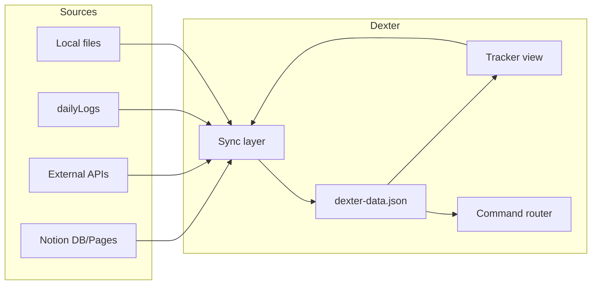
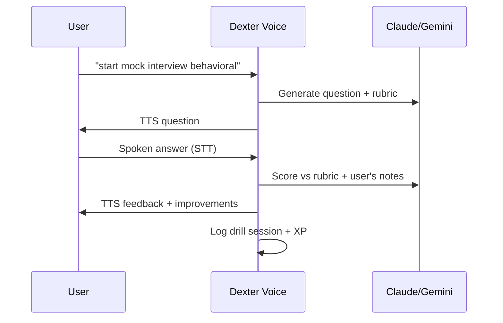
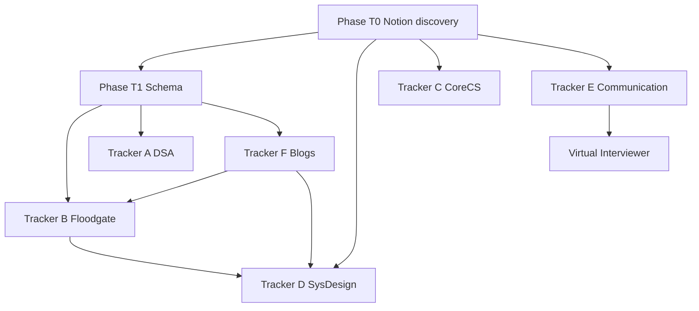

# DEXTER — Axis Trackers & Session Intelligence

> **Version:** 1.0  
> **Parent doc:** [BUILD.md](./BUILD.md)  
> **Purpose:** Specification for per-axis deep trackers — session analysis, progress matrices, Notion parity, and voice-driven workflows.  
> **Audience:** Claude Code — implement phase-by-phase from this document.

---

## Table of Contents

1. [Overview](#1-overview)
2. [Shared Tracker Architecture](#2-shared-tracker-architecture)
3. [Notion Reference Map](#3-notion-reference-map)
4. [Tracker A — DSA / LeetCode](#4-tracker-a--dsa--leetcode)
5. [Tracker B — Floodgate (Portfolio)](#5-tracker-b--floodgate-portfolio)
6. [Tracker C — Core CS (Interview Bank)](#6-tracker-c--core-cs-interview-bank)
7. [Tracker D — System Design](#7-tracker-d--system-design)
8. [Tracker E — Communication + Virtual Interviewer](#8-tracker-e--communication--virtual-interviewer)
9. [Tracker F — Blog Notes](#9-tracker-f--blog-notes)
10. [UI & Navigation Plan](#10-ui--navigation-plan)
11. [Data Schema Extensions](#11-data-schema-extensions)
12. [Implementation Order](#12-implementation-order)
13. [Voice Command Registry (trackers)](#13-voice-command-registry-trackers)
14. [Acceptance Tests](#14-acceptance-tests)

---

## 1. Overview

### Problem today

Dexter's **Placement Sprint** view logs sessions as free-text rows (`activity`, `minutes`, `notes`). The dashboard shows aggregate LeetCode counts and a pentagon radar, but **cannot answer**:

- Which DSA topics you've covered vs. gaps
- Whether you solved anything today and what's next in scope
- Floodgate v1/v2/v3 status from GitHub or local repo
- Which Core CS topics exist in your Interview Bank and their completion state
- System Design syllabus checkbox progress
- Communication drill history + live mock interview feedback
- Engineering blogs read and distilled takeaways (your Notion blog workflow)

### Goal

Each Pentagon axis gets a **specialized tracker module** that:

1. Mirrors your **Notion page structure** (pull templates, push updates)
2. Combines **manual logs + automated sources** (LeetCode API, GitHub, local codebase scan)
3. Surfaces **today / this week / next scope** on the HUD
4. Responds to **voice commands** via existing `handleCommand` / `COMMAND_REGISTRY`
5. Feeds **quests, missions, XP, and persona/LLM context**

### Design principle: Notion-first, Dexter-native

Notion remains the **authoring surface** for long-form notes and templates. Dexter is the **operational layer** — fast logging, live stats, voice, gamification. Sync is bidirectional where possible; Dexter caches locally in `dexter-data.json` for offline use.

---

## 2. Shared Tracker Architecture

### Module pattern (every tracker)

```
trackers/
├── dsa/
│   ├── schema.js          # topic taxonomy, validators
│   ├── sync-leetcode.js   # GraphQL + submission enrichment
│   ├── render.js          # HUD panels
│   └── README.md
├── floodgate/
│   ├── schema.js          # milestone definitions v1→v3
│   ├── sync-github.js     # releases, tags, README, issues
│   ├── scan-local.js      # optional: parse local Go repo
│   └── README.md
├── corecs/
├── sysdesign/
├── comms/
└── blogs/
```

### Per-tracker data flow



### Shared session object (extends daily log)

Every granular session can link back to a parent `dailyLog` or stand alone:

```jsonc
{
  "id": "lc_20260618_001",
  "date": "2026-06-18",
  "axis": "DSA",
  "minutes": 45,
  "source": "manual|leetcode|voice|notion|github",
  "topicIds": ["greedy", "dp-1d"],
  "problemIds": ["leetcode:121", "leetcode:122"],
  "notes": "Greedy clicked: scan once, track running value.",
  "notionPageId": null,
  "_pushed": false
}
```

### Shared UI components (reuse across trackers)

| Component | Purpose |
|-----------|---------|
| **Progress ring** | % of syllabus/topics complete |
| **Today chip** | "3 problems today" / "0 SD reps" |
| **Next scope panel** | Ranked list of what to do next |
| **Topic matrix** | Grid: topic × status (not started / in progress / done / review) |
| **Session timeline** | Filtered log for this axis only |
| **Sync bar** | Last pull time, sync button, error state |

### Notion sync modes

| Mode | When | Direction |
|------|------|-----------|
| **Pull taxonomy** | On boot + manual | Notion → Dexter (topic lists, templates) |
| **Pull progress** | On boot + manual | Notion checkboxes → Dexter status |
| **Push session** | On commit / end of day | Dexter → Notion Daily Log (existing) |
| **Push note** | On "save to notion" | Dexter → axis-specific Notion page |

---

## 3. Notion Reference Map

### Known Notion databases (from codebase)

| Database | Setting key | ID | Dexter usage today |
|----------|-------------|-----|-------------------|
| **Pentagon Daily Log** | `notionDailyLogDb` | `8021776f-fee7-403f-b8e7-5f2f45941e0c` | Push only (`notionPushToday`) |
| **Weekly Ratings** | `notionRatingsDb` | `b4050e5e-3c6a-44a4-a9fd-6538361369c5` | Pull ratings (`notionPullRatings`) |
| **Calisthenics** | `notionWorkoutsDb` | `6c82c364-8e01-4b91-9036-9d8178ae2bba` | Not wired in UI yet |

### Daily Log property mapping (push — as-built)

From `src/app.js` → `notionPushToday()`:

| Notion property | Type | Dexter field |
|-----------------|------|--------------|
| Session | title | `activity` (first 100 chars) |
| Date | date | `date` |
| Axis | multi_select | `axis` |
| Duration (min) | number | `minutes` |
| Output | rich_text | `activity` (full) |
| Observation | rich_text | `notes` |

### Inferred Notion pages (from seed data — user must confirm IDs)

These page/database IDs must be **added to settings** during implementation. Pull once via Notion API and store in `settings.notion*Db` or `settings.notionPage*`.

| Workspace area | Evidence in seed/logs | Expected Notion structure |
|----------------|----------------------|---------------------------|
| **Interview Bank (Core CS)** | `OS: Process vs Thread — 5 lenses in Interview Bank` | Parent page → subject pages (OS, CN, DBMS) → topic blocks with **5 lenses** template |
| **Soft Skills / Communication** | `Soft Skills page built`, TMAY v1/v2, walkthroughs | Pages per drill type: TMAY, project walkthrough, behavioral |
| **System Design syllabus** | `Floodgate SD research — 9 topics`, cold-attempt SD | Checklist database or toggle blocks per topic |
| **Blog digest** | Netflix Hawkins, Uber Cinnamon, Zapier CAP | Database: Title, Source URL, Date, Axis tags, Key takeaways |
| **Floodgate project log** | v1.0.0 tag, v2 health.Tracker, comprehension gap | Build log entries linked to milestones |

### Settings extensions (add to `DEFAULT_DATA`)

```jsonc
"settings": {
  // existing...
  "notionInterviewBankDb": "",      // Core CS topics + lens completion
  "notionSysDesignDb": "",          // SD syllabus checkboxes
  "notionCommunicationDb": "",      // drills + recordings metadata
  "notionBlogDb": "",               // blog digest database
  "notionFloodgatePageId": ""       // optional: project hub page
}
```

### First-time Notion discovery task

When implementing Phase T1, run a one-shot script:

1. List all databases shared with integration (`POST /v1/search`, filter `object=database`)
2. Match by title keywords: `Interview`, `System Design`, `Blog`, `Communication`, `Floodgate`
3. Write IDs to settings; document in `docs/NOTION_MAP.md`

---

## 4. Tracker A — DSA / LeetCode

**Axis:** `DSA`  
**Inspired by:** LeetCode progress charts, NeetCode 150, custom topic sheets

### 4.1 Current state (as-built)

| Feature | Status | Location |
|---------|--------|----------|
| Total solved (E/M/H) | ✅ | `main.js` GraphQL → `DB.leetcode` |
| LC streak / active days | ✅ | Same |
| Dashboard widget | ✅ | `#lc-stats` in Command Center |
| Voice: "solved 3" | ✅ | Rough count log, no problem IDs |
| Voice: "sync leetcode" | ✅ | `refreshLeetCode()` |
| Topic tracking | ❌ | — |
| Per-problem log | ❌ | — |
| Today / week scope | ❌ | — |

### 4.2 Target capabilities

| Capability | Description |
|------------|-------------|
| **Topic coverage map** | Visual grid of patterns (Arrays, Greedy, DP, Trees, Graphs, …) with counts |
| **Total problems** | From LeetCode API + manual entries |
| **Today** | List problems solved today (API recent submissions + manual) |
| **This week** | Count vs. target (seed implies ~14/week as aspirational) |
| **Next scope** | Weakest topic by count, or user-defined queue |
| **Difficulty mix** | Alert if hard ratio too low |
| **Streak bridge** | Dexter study streak + LC platform streak side by side |

### 4.3 Topic taxonomy (seed-informed starter)

Derived from your logged sessions — extend via Notion pull:

```yaml
topics:
  - id: greedy
    name: Greedy
    problems: [buy-sell-stock-i, buy-sell-stock-ii, jump-game]
    status: done  # from logs May 18
  - id: bst
    name: Binary Search Trees
    status: done  # Jun 13 session
  - id: backtracking
    name: Backtracking
    status: done
  - id: dp
    name: Dynamic Programming
    status: in_progress  # Jun 6 "DP + review"
  - id: arrays
    name: Arrays / Two Pointers
    status: not_started
  - id: graphs
    name: Graphs
    status: not_started
  # ... full NeetCode-style list
```

**Source of truth priority:** LeetCode submission tags (if API available) > manual tag on log > parsed from `activity` text.

### 4.4 LeetCode API enrichment (Phase T-A2)

Current GraphQL only returns aggregate counts. Extend with:

```graphql
# recentSubmissions or similar — verify against LeetCode API at implement time
recentAcSubmissionList(username: $u, limit: 20) {
  title slug difficulty timestamp statusDisplay
}
```

Store in `DB.trackers.dsa.recentProblems[]` and `DB.trackers.dsa.byTopic{}`.

**Fallback:** User logs `activity: "LeetCode — Two Sum, Jump Game"` → NLP extract problem names → map to topics via static slug table.

### 4.5 UI — DSA view (new sub-view or replace Sprint tab section)

```
┌─────────────────────────────────────────────────────────┐
│ DSA / LEETCODE UPLINK                    [SYNC] [+ LOG] │
├──────────────────┬──────────────────────────────────────┤
│ TOTAL 127        │ TODAY: 0 problems                    │
│ E 45 · M 62 · H 20│ WEEK: 8 / 14 target                 │
│ LC streak 12d    │ NEXT: Graphs (0 solved) → 2 mediums  │
├──────────────────┴──────────────────────────────────────┤
│ TOPIC MATRIX (click = filter sessions)                  │
│ [Greedy ✓3] [BST ✓] [Backtrack ✓] [DP ◐] [Graphs ○] …  │
├─────────────────────────────────────────────────────────┤
│ RECENT PROBLEMS          │ SESSION LOG (DSA only)       │
│ · Jump Game — M — today  │ · Jun 18 — 17 problems …     │
└─────────────────────────────────────────────────────────┘
```

### 4.6 Voice commands

| Command | Action |
|---------|--------|
| `dsa status` / `leetcode status` | Speak totals, today count, next scope |
| `what topics am I missing` | List topics with 0 problems |
| `log problem two sum medium` | Add to today's problem list + DSA log |
| `sync leetcode` | Existing — refresh aggregates + recent list |

### 4.7 Notion sync

- **Pull:** If you maintain a LeetCode tracker DB in Notion (Topic, Status, Problems solved), merge into `DB.trackers.dsa.topics`
- **Push:** On problem log, optional row in Notion with Topic + Problem + Observation

### 4.8 Implementation tasks

| ID | Task | Depends |
|----|------|---------|
| T-A1 | Add `DB.trackers.dsa` schema + render topic matrix from taxonomy file | — |
| T-A2 | Extend LeetCode fetch with recent submissions | T-A1 |
| T-A3 | Parse existing `dailyLogs` where `axis=DSA` to bootstrap topic counts | T-A1 |
| T-A4 | DSA panel UI in Sprint or new dock tab | T-A1 |
| T-A5 | Next-scope algorithm (min count topic with priority weight) | T-A3 |
| T-A6 | Notion pull for topic DB (when ID configured) | T1 |

---

## 5. Tracker B — Floodgate (Portfolio)

**Axis:** `Portfolio`  
**Project:** Floodgate — Go API gateway (adaptive rate limiting, Redis, Docker)  
**Also track:** BloodConnect, Sphere (secondary projects)

### 5.1 Current state

| Feature | Status | Location |
|---------|--------|----------|
| Session logs mentioning Floodgate | ✅ | `dailyLogs` in seed |
| GitHub repo setting | ✅ | `integrations.github.repo` (SYS modules) |
| CI sentinel (Actions pass/fail) | ✅ | `main.js` polling |
| Milestone tracking | ❌ | — |
| Tag/release awareness | ❌ | — |
| Local codebase scan | ❌ | — |
| What's next | ❌ | — |

### 5.2 Known milestones (from seed data)

| Milestone | Status | Evidence |
|-----------|--------|----------|
| **v1.0.0** | ✅ Shipped & tagged | gateway, auth, dual rate limiting, Redis, distroless Docker (Jun 10) |
| **v2 health.Tracker** | ✅ Built | rolling p95, error rate, `/health`, load-tested (Jun 16) |
| **v2 PID + adaptive per-route** | ⚠️ Shipped, NOT tagged | comprehension gap — v2.0.0 tag deferred (Jun 26) |
| **v3 adaptive limiter** | 📋 Planned | Uber Cinnamon blog → PID + TCP Vegas → Floodgate v2/v3 design |
| **Reverse proxy core** | ✅ In progress early | Jun 3 build session |
| **Redis PING/PONG** | ✅ Done | May 20 tracer bullet |
| **Comprehension recovery** | 🔄 Active | Explicit note on Jun 26 |

### 5.3 Milestone schema

```jsonc
{
  "trackers": {
    "portfolio": {
      "projects": [{
        "id": "floodgate",
        "name": "Floodgate",
        "repo": "user/floodgate",
        "localPath": "D:\\projects\\floodgate",
        "milestones": [
          {
            "id": "fg-v1",
            "title": "v1.0.0 — Gateway MVP",
            "features": ["auth", "dual-rate-limit", "redis", "docker-distroless"],
            "status": "done",
            "tag": "v1.0.0",
            "completedDate": "2026-06-10"
          },
          {
            "id": "fg-v2-health",
            "title": "health.Tracker — p95 + error rate",
            "status": "done",
            "completedDate": "2026-06-16"
          },
          {
            "id": "fg-v2-pid",
            "title": "PID + adaptive per-route limiter",
            "status": "done_untagged",
            "blocker": "comprehension gap — tag deferred",
            "completedDate": "2026-06-26"
          },
          {
            "id": "fg-v2-tag",
            "title": "Tag v2.0.0 after comprehension",
            "status": "open",
            "priority": 1
          },
          {
            "id": "fg-v3-adaptive",
            "title": "v3 — TCP Vegas / adaptive limiter (from Uber blog)",
            "status": "planned",
            "dependsOn": ["fg-v2-tag"]
          }
        ],
        "github": {
          "lastRelease": null,
          "lastTag": null,
          "openIssues": 0,
          "lastCommit": null,
          "workflows": []
        }
      }]
    }
  }
}
```

### 5.4 GitHub sync (extend existing integration)

Beyond CI sentinel, add `github:syncProject` IPC:

| API endpoint | Data |
|--------------|------|
| `GET /repos/{repo}/releases/latest` | Latest release tag, date |
| `GET /repos/{repo}/tags?per_page=10` | Tag list — detect v1.0.0, missing v2.0.0 |
| `GET /repos/{repo}/commits?per_page=5` | Recent commit messages |
| `GET /repos/{repo}/issues?state=open` | Open work items |
| `GET /repos/{repo}/contents/` | Top-level structure (optional) |

**Auto-match:** If GitHub has tag `v1.0.0` → mark milestone done. If code contains `health.Tracker` (local scan) → mark v2-health done.

### 5.5 Local codebase scan (optional sidecar)

`trackers/floodgate/scan-local.js` or Python:

- Path from `integrations.github.repo` → `localPath` setting
- Scan for: `health.Tracker`, `rate.Limiter`, `Dockerfile`, `README` feature list
- Compare against milestone `features[]` checklist
- Emit: `{ type: "scan", found: ["health.Tracker", ...], missing: [...] }`

### 5.6 UI — Floodgate panel

```
┌─────────────────────────────────────────────────────────┐
│ FLOODGATE · PORTFOLIO                    [SYNC GH] [SCAN]│
├─────────────────────────────────────────────────────────┤
│ PROGRESS ████████░░ 72%    LAST COMMIT: 2d ago          │
│ TAGS: v1.0.0 ✓   v2.0.0 ✗ (comprehension blocker)       │
├─────────────────────────────────────────────────────────┤
│ MILESTONES                                              │
│ ✓ v1.0.0 Gateway MVP                          Jun 10   │
│ ✓ health.Tracker + /health                    Jun 16   │
│ ⚠ PID adaptive (untagged)                     Jun 26   │
│ ○ Tag v2.0.0 ← NEXT PRIORITY                          │
│ ○ v3 adaptive limiter (Uber blog)                       │
├─────────────────────────────────────────────────────────┤
│ BUILD LOG (from dailyLogs + Notion)                     │
│ · Jun 26 — comprehension recovery initiated             │
└─────────────────────────────────────────────────────────┘
```

### 5.7 Voice commands

| Command | Action |
|---------|--------|
| `floodgate status` | Milestones done/open, tag state, next step |
| `what's left on floodgate` | Open milestones + blockers |
| `sync floodgate` | GitHub + local scan |
| `create mission tag floodgate v2` | → Mission Control (existing) |

### 5.8 Notion sync

- Pull Floodgate build log pages → merge into milestone notes
- Push session logs with `axis: Portfolio` already go to Daily Log

### 5.9 Implementation tasks

| ID | Task | Depends |
|----|------|---------|
| T-B1 | Milestone schema + seed from BUILD doc / seed.js | — |
| T-B2 | `github:syncProject` IPC | GitHub token in settings |
| T-B3 | UI panel under Portfolio section or Mission view | T-B1 |
| T-B4 | Local scan (optional) | T-B1, localPath setting |
| T-B5 | "Next" = highest priority open milestone | T-B1 |
| T-B6 | Link mission auto-create on blocker detection | Phase 3 missions |

---

## 6. Tracker C — Core CS (Interview Bank)

**Axis:** `Core CS`  
**Inspired by:** Your Notion **Interview Bank** — subjects with topics, each using a **5 lenses** template

### 6.1 Evidence from your workflow

Seed logs:

- `OS: Process vs Thread — 5 lenses in Interview Bank` (May 22)
- `CN: TCP vs UDP filled` (Jun 13)
- `DBMS Indexing via video, notes written` (Jun 22)

**Interpretation:** Each topic is documented through **5 lenses** (define, compare, tradeoffs, when to use, interview soundbite — exact lens names to be pulled from Notion template).

### 6.2 Subject taxonomy (starter)

```yaml
subjects:
  - id: os
    name: Operating Systems
    topics:
      - id: process-vs-thread
        name: Process vs Thread
        lenses: [l1, l2, l3, l4, l5]  # boolean or text per lens
        status: done
        lastReview: "2026-05-22"
      - id: scheduling
        name: CPU Scheduling
        status: not_started
  - id: cn
    name: Computer Networks
    topics:
      - id: tcp-vs-udp
        name: TCP vs UDP
        status: done
      - id: dns
        name: DNS
        status: not_started
  - id: dbms
    name: DBMS
    topics:
      - id: indexing
        name: Indexing
        status: done
      - id: normalization
        name: Normalization
        status: not_started
  - id: coa
    name: Computer Architecture
    topics: []
  - id: oop
    name: OOP / Design Patterns
    topics: []
```

### 6.3 Notion template mirror — 5 Lenses page structure

When pulling a Notion topic page, map blocks to:

```jsonc
{
  "topicId": "process-vs-thread",
  "lenses": {
    "definition": "…",
    "comparison": "…",
    "tradeoffs": "…",
    "whenToUse": "…",
    "interviewAnswer": "…"   // 60s spoken version
  },
  "status": "done|draft|empty",
  "sources": ["video", "book", "blog"]
}
```

**Implementation:** Notion block parser for headings matching lens names (pull once, cache in `DB.trackers.corecs.topics[]`).

### 6.4 UI — Core CS / Interview Bank

```
┌─────────────────────────────────────────────────────────┐
│ INTERVIEW BANK · CORE CS              [PULL NOTION]     │
├──────────────┬──────────────────────────────────────────┤
│ SUBJECTS     │ TOPIC: Process vs Thread                 │
│ OS      2/8  │ L1 Definition        ✓                   │
│ CN      1/6  │ L2 Comparison        ✓                   │
│ DBMS    1/5  │ L3 Tradeoffs         ✓                   │
│ COA     0/4  │ L4 When to use       ✓                   │
│              │ L5 Interview answer  ✓                   │
├──────────────┴──────────────────────────────────────────┤
│ COVERAGE: 4 / 28 topics (14%)   NEXT: OS — Scheduling  │
└─────────────────────────────────────────────────────────┘
```

### 6.5 Session logging enhancement

When logging Core CS session, require **topic picklist** (dropdown from taxonomy) instead of free text only:

```jsonc
{ "axis": "Core CS", "topicId": "tcp-vs-udp", "minutes": 30, "notes": "..." }
```

Voice: `log core cs tcp vs udp 30 minutes` → auto-fill topic.

### 6.6 Voice commands

| Command | Action |
|---------|--------|
| `core cs status` | Topics done / total, next topic |
| `quiz me on tcp vs udp` | TTS reads lens prompts (→ Brain RAG or cached lenses) |
| `what's missing in OS` | List not_started topics in OS |
| `open interview bank` | Notion page or Dexter view |

### 6.7 Implementation tasks

| ID | Task | Depends |
|----|------|---------|
| T-C1 | Taxonomy YAML/JSON in `trackers/corecs/taxonomy.json` | — |
| T-C2 | Notion pull — map Interview Bank DB/pages | T1, notionInterviewBankDb |
| T-C3 | 5-lens template parser | T-C2 |
| T-C4 | UI subject/topic tree + lens checklist | T-C1 |
| T-C5 | Topic picker on session log form | T-C1 |
| T-C6 | Spaced review reminder (7/14/30 day) | T-C4 |

---

## 7. Tracker D — System Design

**Axis:** `System Design`  
**Inspired by:** SD checklist databases, Hello Interview syllabus, your Floodgate **design-through-building** workflow

### 7.1 Evidence from your workflow

- `Floodgate SD research — 9 topics` (Jun 1): API Gateway, Reverse Proxy, Token Bucket, Circuit Breaker, …
- `Sunday catch-up — deferred sketch + new cold-attempt SD` (Jun 20)
- Cross-links: Uber blog → PID → Floodgate v3

### 7.2 Syllabus structure (two layers)

**Layer 1 — Fundamentals (checkbox syllabus):**

```yaml
fundamentals:
  - id: api-gateway
    name: API Gateway
    status: done      # Jun 1 research
  - id: reverse-proxy
    name: Reverse Proxy
    status: done
  - id: token-bucket
    name: Token Bucket / Rate Limiting
    status: done
  - id: circuit-breaker
    name: Circuit Breaker
    status: in_progress
  - id: load-balancing
    name: Load Balancing
    status: not_started
  - id: caching
    name: Caching strategies
    status: not_started
  - id: cap-theorem
    name: CAP / PACELC
    status: done      # Zapier blog Jun 24
  - id: sharding
    name: Sharding & partitioning
    status: not_started
  - id: message-queues
    name: Message queues / Kafka
    status: not_started
```

**Layer 2 — Practice reps (sketch sessions):**

```jsonc
{
  "id": "sd_rep_001",
  "date": "2026-06-20",
  "prompt": "URL shortener (cold attempt)",
  "durationMin": 45,
  "delivered": ["requirements", "api", "db schema"],
  "missing": ["scaling", "cache"],
  "selfGrade": 6,
  "notes": "One-time catch-up"
}
```

### 7.3 UI — System Design tracker

```
┌─────────────────────────────────────────────────────────┐
│ SYSTEM DESIGN · SYLLABUS              [PULL NOTION]     │
├─────────────────────────────────────────────────────────┤
│ FUNDAMENTALS  ██████░░░░  6/14 topics                   │
│ [✓] API Gateway  [✓] Reverse Proxy  [✓] Token Bucket    │
│ [✓] CAP Theorem  [◐] Circuit Breaker  [ ] Sharding …    │
├─────────────────────────────────────────────────────────┤
│ PRACTICE REPS                         [+ LOG SKETCH]    │
│ · Jun 20 — URL shortener cold — 6/10                    │
│ NEXT REP: Design Twitter timeline (never attempted)     │
├─────────────────────────────────────────────────────────┤
│ BUILD LINKS: Floodgate milestones ↔ SD topics covered   │
└─────────────────────────────────────────────────────────┘
```

### 7.4 Checkbox behavior

- Click checkbox → toggle `status` → optional Notion push
- Weekly quest `sd1` already checks `dailyLogs` for today — enhance to accept topic checkbox toggle as credit

### 7.5 Voice commands

| Command | Action |
|---------|--------|
| `system design status` | Fundamentals %, last rep, next topic |
| `log sd sketch url shortener` | Create practice rep entry |
| `what sd topics left` | List not_started fundamentals |
| `mark circuit breaker done` | Toggle checkbox |

### 7.6 Notion sync

- Pull SD syllabus database (checkbox/status property → `status`)
- Push new practice rep as page in SD reps database

### 7.7 Implementation tasks

| ID | Task | Depends |
|----|------|---------|
| T-D1 | Fundamentals taxonomy + seed from Jun 1 log | — |
| T-D2 | Practice rep schema + log form | T-D1 |
| T-D3 | Checkbox UI component | T-D1 |
| T-D4 | Notion pull/push for SD DB | T1 |
| T-D5 | Link SD topics to Floodgate milestones | T-B1, T-D1 |
| T-D6 | "Next rep" rotation (classic prompts list) | T-D2 |

---

## 8. Tracker E — Communication + Virtual Interviewer

**Axis:** `Communication`  
**Inspired by:** Pramp, Interviewing.io, your TMAY / walkthrough drills

### 8.1 Evidence from your workflow

| Drill type | Log evidence |
|------------|--------------|
| **TMAY** | v1 written 65s, v2 recorded (May 22) |
| **LinkedIn / outreach** | Profile reposition + 5 alumni (May 22) |
| **Project walkthrough** | BloodConnect recorded (Jun 19), Floodgate (deferred → mission) |
| **Mock interview** | Polaris Round 2 on-camera (Jun 12) |
| **Soft Skills page** | Built in Notion (May 22) |

### 8.2 Drill taxonomy

```yaml
drillTypes:
  - id: tmay
    name: Tell Me About Yourself
    targetSec: 60-90
    versions: []      # v1, v2 with dates + recording path
  - id: project-walkthrough
    name: Project Walkthrough
    projects: [floodgate, bloodconnect, sphere]
  - id: behavioral
    name: Behavioral (STAR)
    prompts: [conflict, failure, leadership, …]
  - id: technical-communication
    name: Explain technical concept simply
  - id: on-camera
    name: On-camera presence rep
```

### 8.3 Virtual Interviewer (flagship feature)

**Flow:**



**Modes:**

| Mode | API | Offline fallback |
|------|-----|------------------|
| **Question gen** | LLM | Rotating question bank from Notion |
| **Answer capture** | Vosk (existing voice sidecar) | — |
| **Feedback** | LLM with rubric | Template feedback ("add metric", "shorten intro") |

**Rubric dimensions (store per drill type):**

- Clarity (1-5)
- Structure (1-5)
- Specificity / metrics (1-5)
- Time management (1-5)
- Confidence (1-5)

**Sidecar:** `comms/dexter_interviewer.py` OR pure JS in `app.js` using existing voice + `askLlm`.

### 8.4 Session record

```jsonc
{
  "id": "comm_001",
  "date": "2026-06-12",
  "type": "on-camera",
  "prompt": "Polaris Round 2 — who I am",
  "durationMin": 60,
  "recordingPath": null,
  "scores": { "clarity": 4, "structure": 3 },
  "feedback": "Strong opener. Tighten middle transition.",
  "notionPageId": null
}
```

### 8.5 UI — Communication tracker

```
┌─────────────────────────────────────────────────────────┐
│ COMMUNICATION · SOFT SKILLS           [PULL NOTION]     │
├───────────────────────────┬─────────────────────────────┤
│ DRILLS                    │ VIRTUAL INTERVIEWER         │
│ TMAY v2 ✓ May 22          │ [START MOCK ▶]              │
│ BloodConnect walk ✓       │ Mode: Behavioral ▼          │
│ Floodgate walk ○ DEFERRED │ Last score: 3.8/5           │
│ Polaris mock ✓            │                             │
├───────────────────────────┴─────────────────────────────┤
│ NEXT: Floodgate walkthrough (mission linked)            │
└─────────────────────────────────────────────────────────┘
```

### 8.6 Voice commands

| Command | Action |
|---------|--------|
| `start mock interview` | Begin interviewer loop |
| `ask me a behavioral question` | Single question |
| `communication status` | Drills done/pending |
| `practice tmay` | TMAY mode with timer + feedback |

### 8.7 Notion sync

- Pull Soft Skills / Communication DB → drill checklist
- Push mock interview transcript + feedback as new page

### 8.8 Implementation tasks

| ID | Task | Depends |
|----|------|---------|
| T-E1 | Drill taxonomy + log from seed | — |
| T-E2 | Communication UI panel | T-E1 |
| T-E3 | Interviewer loop (voice in/out) | Voice sidecar, LLM key |
| T-E4 | Question bank JSON (offline) | T-E1 |
| T-E5 | Rubric + scoring prompt engineering | T-E3 |
| T-E6 | Notion pull Communication DB | T1 |
| T-E7 | Link deferred drills → missions | Phase 3 |

---

## 9. Tracker F — Blog Notes

**Axis:** Cross-cutting (tags: DSA, System Design, Portfolio)  
**Inspired by:** Readwise, Notion blog digest, your engineering blog habit

### 9.1 Evidence from your workflow

| Blog | Date | Axis tag | Takeaway (from seed) |
|------|------|----------|----------------------|
| Netflix Hawkins engineering | Jun 5 | DSA | Blog habit holding |
| Uber Cinnamon Part 1 — PID + TCP Vegas | Jun 15 | DSA / Portfolio | Feeds Floodgate v2/v3 adaptive limiter |
| Zapier CAP Theorem + video | Jun 24 | System Design | Recurring SD interview topic |

**Workflow:** Read blog → extract key points → store in Notion → sometimes log as `dailyLog` with `minutes: 30`.

### 9.2 Blog entry schema

```jsonc
{
  "id": "blog_001",
  "title": "Uber Cinnamon — PID controller + TCP Vegas",
  "url": "https://…",
  "source": "Uber Engineering",
  "dateRead": "2026-06-15",
  "minutes": 30,
  "axes": ["DSA", "Portfolio"],
  "topics": ["pid-control", "tcp-vegas", "rate-limiting"],
  "takeaways": [
    "PID loop maps to adaptive rate limiter",
    "TCP Vegas congestion signals analogous to backend pressure"
  ],
  "links": {
    "floodgateMilestone": "fg-v3-adaptive",
    "sysDesignTopic": "token-bucket"
  },
  "notionPageId": null,
  "status": "digested|reading|queued"
}
```

### 9.3 UI — Blog Notes / Signal Digest

```
┌─────────────────────────────────────────────────────────┐
│ BLOG NOTES · SIGNAL DIGEST            [PULL NOTION]     │
├─────────────────────────────────────────────────────────┤
│ QUEUE (2)  │  READ (14)  │  DIGESTED (11)              │
├─────────────────────────────────────────────────────────┤
│ + ADD BLOG (url / title / paste takeaways)              │
├─────────────────────────────────────────────────────────┤
│ Jun 24 · Zapier CAP Theorem          [SD] [digested]    │
│   → Linked: CAP topic ✓                               │
│ Jun 15 · Uber Cinnamon PID           [Portfolio]        │
│   → Linked: Floodgate v3 milestone                    │
└─────────────────────────────────────────────────────────┘
```

### 9.4 Auto-linking rules

When saving a blog entry:

1. Match `topics[]` against SD fundamentals + DSA taxonomy + Floodgate milestones
2. Suggest links: "This relates to Token Bucket — mark as source?"
3. If `dailyLog` exists same day with matching title keywords → merge

### 9.5 Voice commands

| Command | Action |
|---------|--------|
| `log blog uber pid takeaways` | Start capture flow (dictation-friendly) |
| `what blogs did I read this week` | List + one-line takeaway |
| `blogs about rate limiting` | Filter + speak |
| `push blog to notion` | Create Notion page from entry |

### 9.6 Notion sync

**Expected Notion Blog DB properties** (discover on T1):

| Property | Type | Dexter field |
|----------|------|--------------|
| Title | title | `title` |
| URL | url | `url` |
| Date Read | date | `dateRead` |
| Axes | multi_select | `axes[]` |
| Takeaways | rich_text | joined `takeaways[]` |
| Status | select | `status` |
| Linked topics | relation | `topics[]`, milestone links |

**Pull:** Merge into `DB.trackers.blogs.entries[]`  
**Push:** New entry → create page; update takeaways on edit

### 9.7 Bootstrap from seed

Parse existing `dailyLogs` where `activity` matches `/blog|engineering blog/i` → create retroactive blog entries.

### 9.8 Implementation tasks

| ID | Task | Depends |
|----|------|---------|
| T-F1 | Blog schema + seed from dailyLogs | — |
| T-F2 | Add/edit UI + takeaway form | T-F1 |
| T-F3 | Notion pull/push Blog DB | T1 |
| T-F4 | Auto-link to SD/DSA/Floodgate | T-F1, T-D1, T-B1 |
| T-F5 | Voice log flow | Dictation + parser |
| T-F6 | Dashboard widget "Recent blogs" | T-F1 |

---

## 10. UI & Navigation Plan

### Option A — Expand Placement Sprint (recommended v1)

Keep one **SPRINT** dock tab; add **axis sub-tabs** inside:

```
[ DSA ] [ Portfolio ] [ Core CS ] [ Sys Design ] [ Communication ] [ Blogs ]
```

Each sub-tab renders its tracker panel. Shared session log form adapts fields per axis.

### Option B — New dock icon "INTEL" (Ctrl+9)

Dedicated tracker hub; Sprint stays minimal.

**Recommendation:** Option A first (less navigation churn), Option B if Sprint gets crowded.

### Dashboard widgets (Command Center)

Add compact cards per axis:

| Widget | Data |
|--------|------|
| DSA chip | today count / week target |
| Floodgate chip | next milestone |
| Core CS chip | topics % |
| SD chip | fundamentals % |
| Comm chip | next drill |
| Blog chip | last digest |

---

## 11. Data Schema Extensions

Add to `DEFAULT_DATA` in `main.js`:

```jsonc
{
  "trackers": {
    "dsa": {
      "topics": [],
      "problems": [],
      "weekTarget": 14,
      "lastSync": null
    },
    "portfolio": {
      "projects": []
    },
    "corecs": {
      "subjects": []
    },
    "sysdesign": {
      "fundamentals": [],
      "reps": []
    },
    "communication": {
      "drills": [],
      "mockSessions": []
    },
    "blogs": {
      "entries": []
    }
  },
  "settings": {
    "notionInterviewBankDb": "",
    "notionSysDesignDb": "",
    "notionCommunicationDb": "",
    "notionBlogDb": "",
    "notionFloodgatePageId": "",
    "floodgateLocalPath": ""
  }
}
```

**Migration:** On load, if `trackers` missing → init empty + run bootstrap scripts (parse dailyLogs, seed milestones).

---

## 12. Implementation Order

### Phase T0 — Notion discovery (prerequisite)

| Task | Output |
|------|--------|
| T0.1 | Script: list Notion DBs → `docs/NOTION_MAP.md` |
| T0.2 | User confirms IDs → settings keys |
| T0.3 | Sample pull for each DB → validate property mapping |

### Phase T1 — Schema + bootstrap

| Task | Output |
|------|--------|
| T1.1 | `trackers` schema in DEFAULT_DATA |
| T1.2 | Bootstrap from `dailyLogs` + seed milestones |
| T1.3 | Shared tracker render utilities |

### Phase T2 — Quick wins (no Notion required)

| Order | Tracker | Why first |
|-------|---------|-----------|
| 1 | **T-B** Floodgate | Milestones known; GitHub already partially wired |
| 2 | **T-A** DSA | LeetCode API already wired; high daily use |
| 3 | **T-F** Blogs | Easy parse from existing logs |

### Phase T3 — Notion-backed trackers

| Order | Tracker |
|-------|---------|
| 4 | **T-D** System Design | Checkbox syllabus |
| 5 | **T-C** Core CS | 5-lens template pull |
| 6 | **T-E** Communication drills | Soft Skills DB |

### Phase T4 — Virtual Interviewer

| Task | Depends |
|------|---------|
| T-E3 Interviewer loop | LLM key, voice sidecar |
| T-E5 Rubric tuning | Real mock sessions |

### Dependency graph



---

## 13. Voice Command Registry (trackers)

Add to `docs/COMMANDS.md` as implemented:

| Command | Tracker | Phase |
|---------|---------|-------|
| `dsa status` | A | T2 |
| `what topics am I missing` | A | T2 |
| `floodgate status` | B | T2 |
| `what's left on floodgate` | B | T2 |
| `sync floodgate` | B | T2 |
| `core cs status` | C | T3 |
| `quiz me on [topic]` | C | T3 + Brain |
| `system design status` | D | T3 |
| `mark [topic] done` | D | T3 |
| `log sd sketch [prompt]` | D | T3 |
| `communication status` | E | T3 |
| `start mock interview` | E | T4 |
| `practice tmay` | E | T4 |
| `log blog [title]` | F | T2 |
| `blogs this week` | F | T2 |

---

## 14. Acceptance Tests

### Tracker A — DSA

```
[ ] Sync LeetCode → total matches leetcode.com
[ ] Topic matrix shows Greedy/BST/Backtracking from bootstrap
[ ] Log problem via voice → appears in today list
[ ] "dsa status" speaks next scope
[ ] Week counter compares to weekTarget
```

### Tracker B — Floodgate

```
[ ] Milestones show v1 done, v2 untagged blocker
[ ] GitHub sync populates last tag / last commit
[ ] "floodgate status" speaks next: tag v2.0.0
[ ] Local scan finds health.Tracker if present in repo
```

### Tracker C — Core CS

```
[ ] Subject tree shows OS/CN/DBMS counts
[ ] Notion pull populates 5 lenses for Process vs Thread
[ ] Topic picker on session log
[ ] "quiz me on tcp vs udp" returns lens content
```

### Tracker D — System Design

```
[ ] Fundamentals checkboxes toggle and persist
[ ] Jun 1 topics marked done from bootstrap
[ ] Practice rep log creates entry
[ ] Notion sync round-trips checkbox state
```

### Tracker E — Communication

```
[ ] Drill list matches seed (TMAY, BloodConnect, Polaris)
[ ] Mock interview: question → STT answer → feedback spoken
[ ] Session saved with scores
[ ] Deferred Floodgate walkthrough links to mission
```

### Tracker F — Blogs

```
[ ] 3 seed blogs appear with takeaways
[ ] Uber blog links to Floodgate v3 milestone
[ ] Zapier blog links to CAP topic
[ ] Push creates Notion page with correct properties
```

---

## Appendix A — Cross-tracker links

| From | To | Link type |
|------|-----|-----------|
| Blog: Uber PID | Floodgate v3 milestone | `links.floodgateMilestone` |
| Blog: Zapier CAP | SD: cap-theorem | `links.sysDesignTopic` |
| SD: token-bucket | Floodgate v1 feature | milestone feature tag |
| DSA session | Quest `dsa2` | existing quest test |
| Comm: Floodgate walk | Mission | mission title match |
| Core CS topic | Brain RAG chunk | `topicId` as tag |

---

## Appendix B — Files to create (summary)

```
docs/
├── TRACKERS.md          ← this file
├── NOTION_MAP.md        ← filled by Phase T0
└── specs/
    ├── 020-dsa-tracker.md
    ├── 021-floodgate-tracker.md
    ├── 022-corecs-tracker.md
    ├── 023-sysdesign-tracker.md
    ├── 024-communication-interviewer.md
    └── 025-blog-notes-tracker.md

trackers/
├── shared.js
├── dsa/
├── floodgate/
├── corecs/
├── sysdesign/
├── comms/
└── blogs/
```

---

*Last updated: 2026-07-04 · Sync with BUILD.md Phase 9+ when implementing.*
